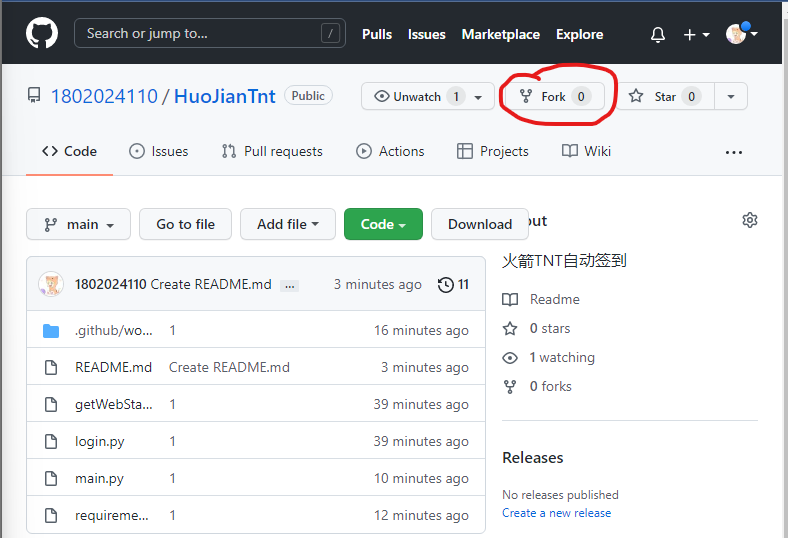
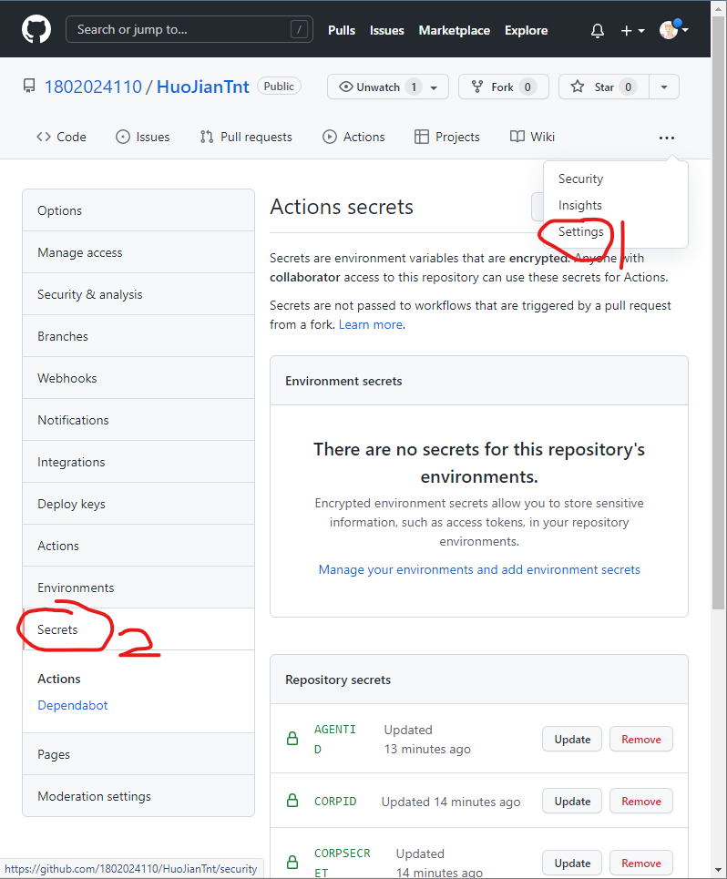
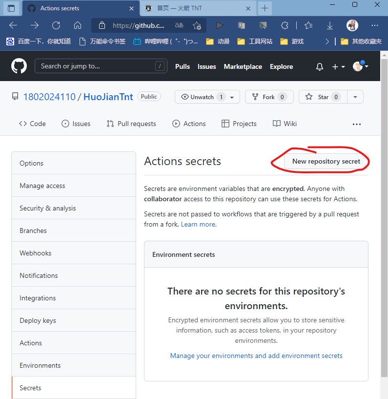
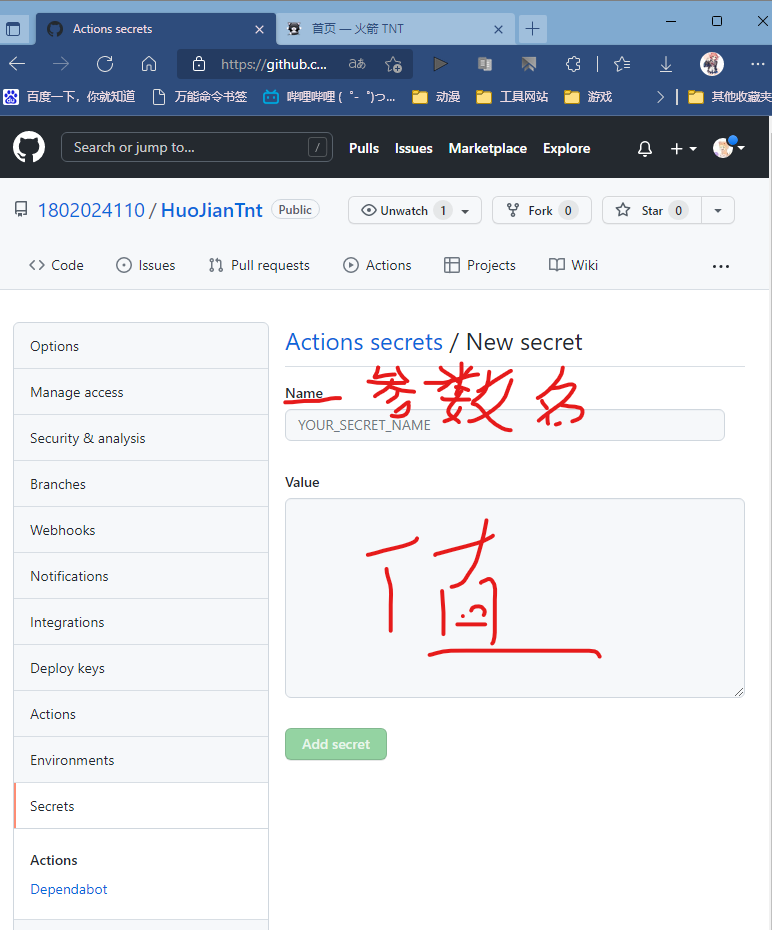
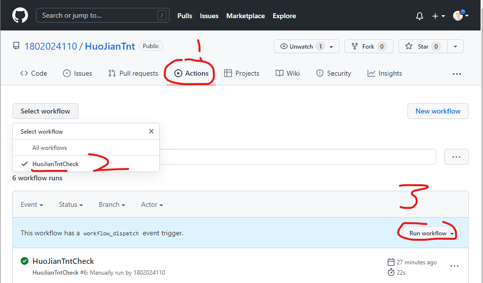
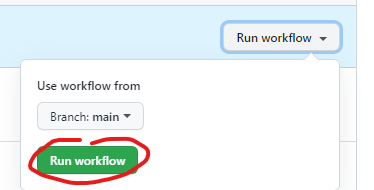

# 【火箭TNT自动签到】

## 使用说明
1、fock到自己的项目

2、切换到Settings\Secrets

3、点击New repository secret

4、依次填写以下参数

|   参数名   |   值   | 是否必须 |          含义          |
| :--------: | :----: | :------: | :--------------------: |
|  username  | string |    是    |         用户名         |
|  password  | string |    是    |          密码          |
|   corpid   | string |    否    |       企业微信ID       |
| corpsecret | string |    否    | 企业微信应用的凭证密钥 |
|  agentid   | string |    否    |    企业微信应用的ID    |

5、启用Action

## 其它说明
暂时能用就行，只支持企业微信应用推送消息，如果有人用我就继续加其他的推送